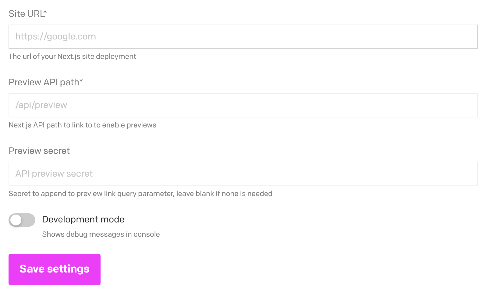
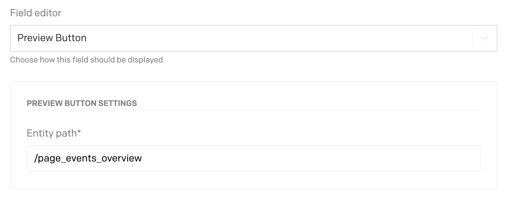
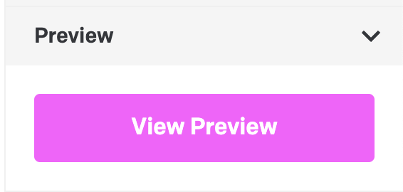

# Next.js Preview Button DatoCMS Plugin

Plugin that adds quick links to preview & view your DatoCMS on a Next.js site.
Assumes you have a preview implementation based off of the [official Next.js Preview Mode guide](https://nextjs.org/docs/advanced-features/preview-mode).

## Configuration

After installing the plugin, you'll need to configure the plugin settings like so:

Then on each model you'd like to be able to preview, you'll need to add a JSON field, and under the "Presentation"
tab, you'll want to select "Next.js Preview Links v2" as the "Field editor", and fill out the entity path for the
given entity on your site. You can sub in any field on the entity using the $field_name, e.g. /blog/$slug or
/product/$id.

## Preview Links

Once you've configured the plugin and added the field to a model, you will be able to see it as a sidebar widget.

A blog post with a slug of `my-first-post` using the configuration from the example above would link to:

- `https://my-next-site.com/api/preview?secret=some-super-secret-key&slug=/blog/my-first-post` for the "Preview" link
- `https://my-next-site.com/blog/my-first-post` for the "View published" link

The query params on the API preview path are not configurable, and are based on Next.js'
[Preview Mode guide](https://nextjs.org/docs/advanced-features/preview-mode).

## Development

If you want to develop on this extension, the quickest way is to run `yarn start` and manually install it by going to Settings > Plugins,
clicking the add button, and clicking "create a private one" in the lower right. Give it:

- A name of your choosing
- An entry point URL of `http://localhost:3000`

## Forks

Fork of https://github.com/wbobeirne/datocms-plugin-nextjs-preview & https://github.com/vsimak/datocms-plugin-nextjs-preview-multilang-sidebar

Important changes:

- Updated to use plugin v2 a
- Fixed bugs with single instances.
- Remove exit preview button
